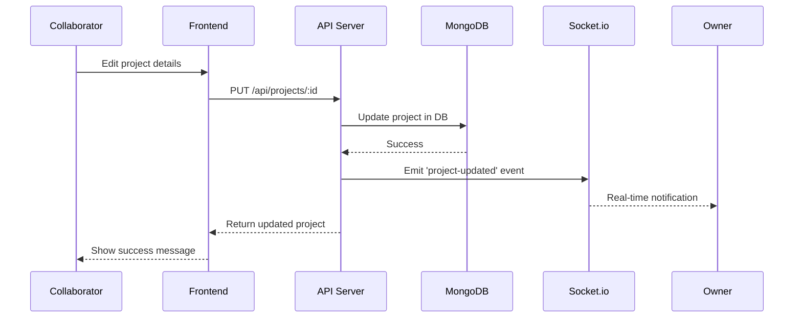

# 🤝 Collaboration System Guide

## Overview
Complete guide explaining how invited collaborators interact with projects, skills, chats, and the entire portfolio system.

---

## 🔐 User Roles & Permissions

### 1. **Owner** (Portfolio Owner)
**Email:** devtechs842@gmail.com  
**Password:** pass1234

#### Full Access:
- ✅ View & Edit all projects
- ✅ Add/Edit/Delete skills
- ✅ Access analytics dashboard
- ✅ Manage collaborators
- ✅ Approve/Reject collaboration requests
- ✅ Access chat system
- ✅ Theme customization
- ✅ Portfolio editor
- ✅ Media management
- ✅ Email management
- ✅ Settings configuration

### 2. **Collaborator** (Invited Users)
**Access Code:** COLLAB2024 (Demo)

#### Limited Access:
- ✅ View & Edit projects (assigned ones)
- ✅ View skills (can suggest changes)
- ✅ Access collaboration chat
- ✅ Use AI assistant
- ✅ View basic analytics
- ❌ Cannot manage other collaborators
- ❌ Cannot delete portfolio
- ❌ Limited settings access

### 3. **Visitor** (Public Access)
- ✅ View public portfolio
- ✅ View projects showcase
- ✅ Submit collaboration requests
- ✅ Contact form access
- ❌ No dashboard access

---

## 📋 How the Collaboration System Works

### Step 1: **Submitting a Collaboration Request**

Anyone can submit a collaboration request from the public portfolio:

```javascript
// From Contact/Collaboration page
POST /api/collaboration/request
{
  "name": "John Developer",
  "email": "john@example.com",
  "role": "Frontend Developer",
  "message": "Would love to collaborate on React projects",
  "skills": ["React", "TypeScript", "TailwindCSS"]
}
```

**What Happens:**
1. Request stored in database (MongoDB)
2. Request appears in Owner's "Collaboration Requests" dashboard
3. Status: `pending`

---

### Step 2: **Owner Reviews Request**

Owner logs into dashboard and navigates to **"Collab Requests"** section:

**View Options:**
- See all pending requests
- Review applicant details
- Check submitted skills
- Read collaboration message

**Owner Actions:**
```javascript
// Approve Request
POST /api/collaboration/approve/{requestId}

// Reject Request  
POST /api/collaboration/reject/{requestId}
```

---

### Step 3: **Approval Process**

When Owner **approves** a request:

1. **Invite Link Generated:**
```
http://localhost:5173/invite/xyz789abc123
```

2. **Invite Link Properties:**
   - Unique token for security
   - Email-specific (only that email can use it)
   - Expires in 7 days
   - One-time use only

3. **Owner sends invite link** to collaborator via:
   - Email (manual or automated)
   - Direct message
   - Any communication channel

---

### Step 4: **Collaborator Accepts Invite**

Collaborator receives invite link and:

1. **Clicks the invite link**
2. **Redirected to registration page**
3. **Creates account:**
   - Sets password
   - Confirms email
   - Accepts terms

```javascript
POST /api/collaboration/accept-invite/{token}
{
  "password": "securepassword123"
}
```

4. **Account Created:**
   - Added to `collaborators` collection in database
   - Role: `collaborator`
   - Status: `active`

---

### Step 5: **Collaborator Login**

After account creation:

```javascript
// Login as Collaborator
POST /api/auth/login
{
  "email": "john@example.com",
  "password": "securepassword123"
}

// Returns JWT Token
{
  "success": true,
  "token": "eyJhbGciOiJIUzI1NiIs...",
  "user": {
    "id": "collab_001",
    "name": "John Developer",
    "email": "john@example.com",
    "role": "collaborator"
  }
}
```

---

## 💼 What Collaborators Can Do

### 1. **Projects Management**

#### View All Projects
```javascript
GET /api/projects
// Returns all projects (with role-based filtering)
```

**Collaborator Access:**
- View all public projects
- Edit assigned projects only
- Cannot delete projects
- Can add comments/notes

#### Create New Project (if permissions granted)
```javascript
POST /api/projects
{
  "title": "New Mobile App",
  "description": "A React Native app for...",
  "technologies": ["React Native", "Firebase"],
  "status": "in-progress",
  "category": "Mobile",
  "collaborators": ["collab_001"]
}
```

#### Edit Project
```javascript
PUT /api/projects/{projectId}
{
  "description": "Updated description...",
  "status": "completed"
}
```

**What Gets Saved:**
- MongoDB stores project updates
- Revision history tracked
- Collaborator credited in project

---

### 2. **Skills Management**

#### View Skills
```javascript
GET /api/skills
// Returns all portfolio skills
```

**Collaborator Can:**
- View technical skills (React, Node.js, etc.)
- View professional skills (Leadership, etc.)
- Suggest new skills to owner
- Rate skill proficiency

#### Suggest Skill Addition (Owner approval needed)
```javascript
POST /api/skills/suggest
{
  "name": "GraphQL",
  "level": 75,
  "category": "Backend",
  "suggestedBy": "collab_001"
}
```

**Workflow:**
1. Collaborator suggests skill
2. Owner receives notification
3. Owner approves/rejects
4. If approved → Added to skills database

---

### 3. **Chat System (Real-time Collaboration)**

#### Connect to Chat
```javascript
// Socket.io connection
const socket = io('http://localhost:5000', {
  auth: { token: userToken }
});

// Join collaboration room
socket.emit('join-room', { roomId: 'portfolio_main' });
```

#### Send Messages
```javascript
socket.emit('send-message', {
  roomId: 'portfolio_main',
  message: 'Working on the new project section!',
  sender: {
    id: 'collab_001',
    name: 'John Developer',
    role: 'collaborator'
  }
});
```

**Chat Features:**
- ✅ Real-time messaging
- ✅ File sharing
- ✅ Code snippets
- ✅ Task assignments
- ✅ @mentions
- ✅ Message history stored in MongoDB

**Chat Storage:**
```javascript
// MongoDB Chat Schema
{
  _id: ObjectId,
  roomId: 'portfolio_main',
  sender: {
    userId: 'collab_001',
    name: 'John Developer',
    avatar: 'JD'
  },
  message: 'Let me review the new design',
  timestamp: ISODate("2024-10-21T20:25:00Z"),
  readBy: ['owner_001'],
  attachments: []
}
```

---

## 📊 Data Storage in MongoDB

### Database Collections

#### 1. **users** Collection
```javascript
{
  _id: ObjectId("..."),
  email: "john@example.com",
  passwordHash: "$2b$10$...",
  name: "John Developer",
  role: "collaborator",
  joinedAt: ISODate("2024-01-20T10:00:00Z"),
  status: "active",
  permissions: {
    projects: { view: true, edit: true, delete: false },
    skills: { view: true, suggest: true, edit: false },
    chat: true,
    analytics: { view: true, export: false }
  }
}
```

#### 2. **projects** Collection
```javascript
{
  _id: ObjectId("..."),
  title: "E-Commerce Platform",
  description: "Full-stack e-commerce solution",
  technologies: ["React", "Node.js", "MongoDB"],
  status: "in-progress",
  category: "Web",
  createdBy: "owner_001",
  collaborators: ["collab_001", "collab_002"],
  assignedTo: "collab_001",
  links: {
    github: "https://github.com/...",
    live: "https://demo.example.com"
  },
  images: [
    { url: "https://...", caption: "Homepage" }
  ],
  featured: true,
  lastUpdated: ISODate("2024-10-21T15:30:00Z"),
  createdAt: ISODate("2024-01-15T10:00:00Z")
}
```

#### 3. **skills** Collection
```javascript
{
  _id: ObjectId("..."),
  name: "React",
  level: 90,
  category: "Frontend",
  type: "technical",
  color: "#61dafb",
  icon: "fa-brands fa-react",
  yearsOfExperience: 3,
  projects: ["proj_001", "proj_002"],
  endorsements: [
    { by: "collab_001", message: "Expert in React!" }
  ]
}
```

#### 4. **collaborationRequests** Collection
```javascript
{
  _id: ObjectId("..."),
  name: "Alex Johnson",
  email: "alex@example.com",
  role: "UI Designer",
  message: "Interested in designing portfolio layouts",
  skills: ["Figma", "Adobe XD", "UI/UX"],
  status: "pending", // pending | approved | rejected
  submittedAt: ISODate("2024-10-20T12:00:00Z"),
  reviewedBy: null,
  inviteToken: null
}
```

#### 5. **inviteLinks** Collection
```javascript
{
  _id: ObjectId("..."),
  token: "xyz789abc123",
  email: "alex@example.com",
  name: "Alex Johnson",
  role: "collaborator",
  createdAt: ISODate("2024-10-21T14:00:00Z"),
  expiresAt: ISODate("2024-10-28T14:00:00Z"),
  used: false
}
```

#### 6. **chatMessages** Collection
```javascript
{
  _id: ObjectId("..."),
  roomId: "portfolio_main",
  sender: {
    userId: "collab_001",
    name: "John Developer",
    avatar: "JD",
    role: "collaborator"
  },
  message: "Just pushed the new feature!",
  type: "text", // text | file | code | task
  timestamp: ISODate("2024-10-21T20:25:00Z"),
  readBy: ["owner_001"],
  reactions: [
    { emoji: "👍", by: "owner_001" }
  ]
}
```

---

## 🔄 Real-Time Collaboration Flow

### Example Workflow: Collaborator Edits a Project



---

## 📱 API Endpoints Summary

### Collaboration Endpoints
```javascript
// View all requests (Owner only)
GET /api/collaboration/requests

// Submit collaboration request (Public)
POST /api/collaboration/request

// Approve request (Owner only)
POST /api/collaboration/approve/:id

// Reject request (Owner only)
POST /api/collaboration/reject/:id

// Get collaborators (Owner only)
GET /api/collaboration/collaborators

// Accept invite (New collaborator)
POST /api/collaboration/accept-invite/:token
```

### Project Endpoints (Collaborators have access)
```javascript
GET /api/projects           // View all projects
GET /api/projects/:id       // View single project
POST /api/projects          // Create project (if permitted)
PUT /api/projects/:id       // Update project (if assigned)
DELETE /api/projects/:id    // Delete (Owner only)
```

### Skills Endpoints
```javascript
GET /api/skills             // View all skills
POST /api/skills/suggest    // Suggest new skill (Collaborator)
POST /api/skills            // Add skill (Owner only)
PUT /api/skills/:id         // Update skill (Owner only)
```

---

## 🎯 Complete Collaboration Example

### Scenario: Collaborator joins and works on a project

1. **Alex submits request** → Stored in MongoDB
2. **Owner approves** → Invite link generated
3. **Alex receives invite** → Creates account
4. **Alex logs in** → JWT token issued
5. **Alex views projects** → Fetches from MongoDB
6. **Alex assigned to "Mobile App" project** → Database updated
7. **Alex edits project** → Updates saved to MongoDB
8. **Alex messages in chat** → Real-time via Socket.io, stored in DB
9. **Owner gets notification** → Real-time update
10. **Owner reviews changes** → Views from MongoDB
11. **Owner approves changes** → Project status updated

---

## 🔧 Testing the System

### Test as Owner:
```bash
1. Login: devtechs842@gmail.com / pass1234
2. Go to Dashboard → Collab Requests
3. Review pending requests
4. Approve/Reject requests
5. View active collaborators
```

### Test as Collaborator:
```bash
1. Submit request via public form
2. Wait for owner approval
3. Use invite link to register
4. Login with your credentials
5. Access dashboard (limited features)
6. Edit assigned projects
7. Use chat system
```

---

## 📊 Summary Table

| Feature | Owner | Collaborator | Visitor |
|---------|-------|-------------|---------|
| View Projects | ✅ | ✅ | ✅ (Public) |
| Edit Projects | ✅ | ✅ (Assigned) | ❌ |
| Delete Projects | ✅ | ❌ | ❌ |
| Add Skills | ✅ | ❌ (Suggest) | ❌ |
| View Analytics | ✅ | ✅ (Limited) | ❌ |
| Chat Access | ✅ | ✅ | ❌ |
| Manage Collaborators | ✅ | ❌ | ❌ |
| Submit Requests | ✅ | ✅ | ✅ |

---

## 🚀 Next Steps

**To fully test the system:**
1. Start both servers (backend on 5000, frontend on 5174)
2. Login as owner
3. Approve demo collaboration requests
4. Use the generated invite link
5. Register as new collaborator
6. Test project editing
7. Try the chat system

**All data persists in MongoDB!** 🎉
